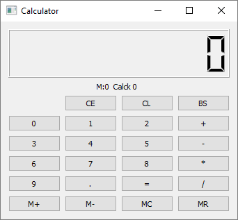
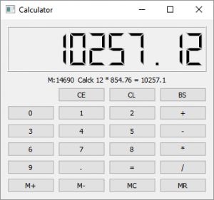

# SimpleCalc

##Калькулятор в Qt Creator. Как можно быстро создать проект в Qt
Как то попросил знакомый, как быстро можно начать писать в Qt Creator.
---

Решил ему быстренько показать используя старые заготовки (проверено под Windows, Ubuntu, Mac OS).
---

Думал быстр, а заняло часа три. Так как была и отладка и компиляция статического проекта. Прикольно, проект, всего ничего, три крошечных файла, и при этом статический файл калькулятора занимает всего 16 118 784 байта,  его же вариант с отладочной информацией 398 940 296 байт!
---

Открываем Qt Creator и в нем создаем новый проект Приложение Qt Widget.
---

А там подправил всего три файла и в результате такой себе вычислитель

Весь проект (копия) на <a href = "Bhttps://github.com/Michael-VT/zNunits">GitHU</a>
---

И на сайте <a href="http://comdev.com.ua/%D0%BA%D0%B0%D0%BB%D1%8C%D0%BA%D1%83%D0%BB%D1%8F%D1%82%D0%BE%D1%80-%D0%B2-qt-creator-%D0%BA%D0%B0%D0%BA-%D0%BC%D0%BE%D0%B6%D0%BD%D0%BE-%D0%B1%D1%8B%D1%81%D1%82%D1%80%D0%BE-%D1%81%D0%BE%D0%B7%D0%B4/">ComDev.com.ua</a>

